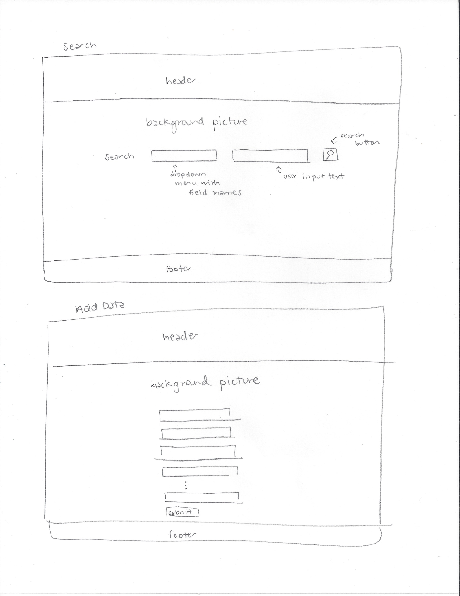
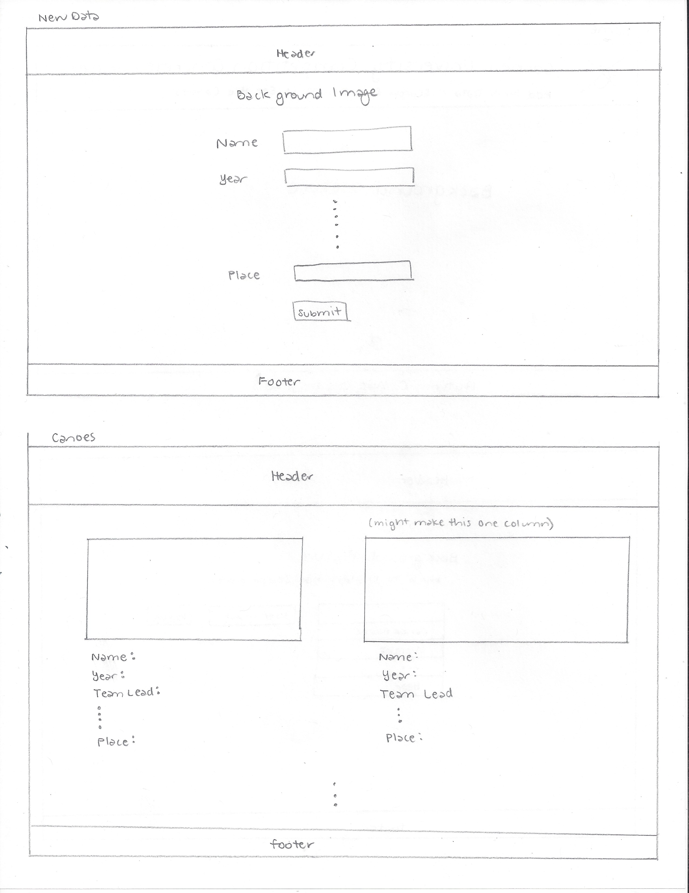

# Project 2, Milestone 1 - Design & Plan

Your Name: Autumn C. Watt

## 1. Persona

I've selected **[Abby]** as my persona.

I've selected my persona because... I strive to create a minimalistic, simple, and intuitive design that can easily be accessed by viewers. This website will act as an informative site for any one wanting to learn about competition canoes from the past of Cornell Concrete Canoe and I would like to make information easily accessible so they interested by my project team's accomplishments.

## 2.Describe your Catalog

My collection will be about our past racing canoes and the team behind who created them, the physical attributes that were achieved, and the result of the competition.

## 3. Sketch & Wireframe

[Insert your 1 sketch here.]

[Insert your 1 wireframe here.]

The links in the header are very explicit as to their purpose. Additionally, the color will change based on the current page so that they do not get lost. Each page has minimal content so it's easy to focus on each pages purpose.

## 4. Database Schema Design

[Describe the structure of your database. You may use words or a picture. A bulleted list is probably the simplest way to do this.]

Table: cornellconcretecanoe
* field 1: year - year canoe was built
* field 2: name - name of canoe
* field 3: team_lead - team lead of canoe
* field 4: tensile_strength - tensile strength of canoe [psi]
* field 5: compressive_strength - compressive strength of canoe [psi]
* field 6: weight - weight of canoe [lbs]
* field 7: place - place of canoe at regional competition

## 5. Database Query Plan

[Plan your database queries. You may use natural language, pseudocode, or SQL.]

1. SQL: SELECT * FROM cornellconcretecanoe

2. SQL: SELECT * FROM cornellconcretecanoe WHERE 'selected field' = 'user input'

3. Add new database entry from a form which collects all seven fields

## 6. *Filter Input, Escape Output* Plan

field 1: should be a number after 2000 (the founding of the organization) and up to the current year
field 2: should be text that starts with a capital letter and is not an empty string
field 3: team lead should be text that starts with a capital letter and is not an empty string
field 4: number greater than 0
field 5: number greater than 0
field 6: number greater than 0
field 7: number between 1 and 10

Escape values with FILTER_SANITIZE_STRING

[Describe your plan for filtering the input from your HTML forms. Describe your plan for escaping any values that you use in HTML or SQL. You may use natural language and/or pseudocode.]

## 7. Additional Code Planning

The Canoes page will feature a picture of the canoe with it's competition data. Since there's no way to upload the image through the entry form, if it is a new entry without a photo in the html folder "images", it will display a generic grey image.

If they search a number field, like strengths or weight, I would like to return all results 'better', so lighter weight and higher strengths.

For placing, add 'st', 'rd', or 'nd' depending on the number
